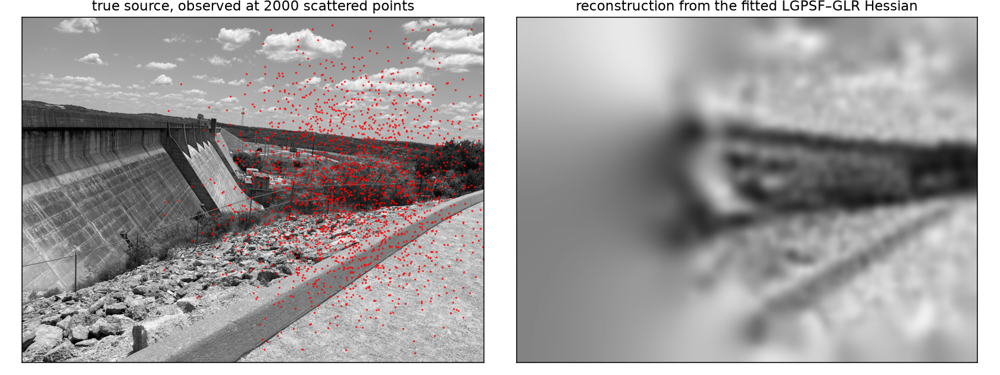

# lgpsf-hessian

Distributed-memory approximation of Hessians (or similar operators) with local point-spread structure using Laguerre-Gaussian point spread function (LG-PSF) row fits and a prior-preconditioned global low rank (GLR) eigendecomposition, on a PETSc backend.



*From the worked example (`examples/heat/`): a source observed through the heat
equation at 2000 scattered points, and its Bayesian reconstruction computed
entirely through the fitted LGPSF–GLR Hessian — 60 true Hessian applies for the
whole posterior, sampling included.*

The intended user has a **Hessian**

`H = Hd + c Hr`

which consists of a **misfit Hessian** `Hd` which is available only through matvecs (each one a
forward + adjoint PDE solve), a **prior / regularization Hessian**

`Hr = Z M⁻¹ Z`

which consists of a diagonal **lumped mass matrix**, `M`, and differential operator `Z`. 
For example if `Z` is a shifted Laplacian, then `Hr` is a bi-Laplacian, corresponding to an
inverse problem with a prior in the Matern class. The scalar `c` is a regularization or prior variance parameter.

The library gives you, in three stages:

1. **Fit** — probe the misfit Hessian with random vectors and fit every row with an LG-PSF
   (via the [lgpsf](https://github.com/NickAlger/lgpsf) library), assembling a sparse
   approximation `B ≈ Hd`. Accuracy is one knob: probes are added until a held-out
   energy-ratio QC (≈ relative Frobenius error in mass-whitened variables) meets your
   target.
2. **GLR** — randomized eigendecomposition of the prior-preconditioned misfit Hessian approximation
   `F = M^{1/2} Z⁻¹ B Z⁻¹ M^{1/2} ≈ U Λ Uᵀ` (never formed), with a deterministic
   partition-independent sketch and first-class incremental rank growth.
3. **Downstream** — operations with `H(c) = B + c Hr`, one build serving every shift `c`:
   solves (Newton-CG preconditioning), sampling with covariance `H(c)⁻¹` (MCMC
   proposals), truncation-consistent log-determinants and matrix functions in
   prior-weighted coordinates.

Optionally, between 2 and 3: **correct** — deflate the dominant modes of the
approximation error against the *true* Hessian (`lgh_glr_correct_probes`
reuses the fit's probe pairs for the error basis free of charge and spends a
small budget of true Hessian applies pricing them exactly), grafting a signed
low-rank correction into the same `(U, Λ)` so every downstream operation
serves the better operator unchanged.

Requires a diagonal (lumped) mass matrix. Dimension-generic (2D and 3D).

## Quickstart

```c
#include <lgpsf_hessian/lgpsf_hessian.h>
/* ...and put  #include <lgpsf_hessian/impl.hpp>  in ONE C++ TU of your build. */

/* Stage 1 — sparse LG-PSF approximation of your misfit Hessian */
lgh_fit_t *fit = lgh_fit_create(comm, dim, nloc, gid0, coords, mass_lumps, nthreads);
lgh_fit_opts_t fo = lgh_fit_opts_default();
lgh_fit_report_t frep;
lgh_fit_hessian(fit, my_misfit_hessian_apply, my_ctx, sigma, &fo, &frep);
Mat B;  lgh_fit_get_mat(fit, &B);                 /* symmetric MPIAIJ */

/* Stage 2 — global low rank in the prior-preconditioned frame (R = Z M^{-1} Z) */
lgh_prior_t *prior;  lgh_prior_create_mat(Z, mass_vec, NULL, &prior);
lgh_glr_opts_t go = lgh_glr_opts_default();
lgh_glr_t *glr;  lgh_glr_report_t grep;
lgh_glr_compute(B, prior, &go, &glr, &grep);
lgh_glr_extend(glr, 200, &grep);                  /* rank not converged? grow it */

/* Stage 2.5 (optional) — deflate the remaining error against the TRUE
 * Hessian, reusing the fit's probe pairs for the basis (free) plus a small
 * budget of true applies for exact Rayleigh values */
lgh_glr_correct_opts_t co = lgh_glr_correct_opts_default();
co.c0 = c;  co.applies = 40;
lgh_glr_correct_probes(glr, k, V, HV, my_misfit_hessian_apply, my_ctx, &co, &crep);

/* Stage 3 — downstream with H(c) = B + c R */
lgh_glr_solve (glr, c, rhs, x);                   /* x = H(c)^{-1} rhs           */
lgh_glr_sample(glr, c, xi,  x);                   /* draw with covariance H(c)^{-1} */
double ld = lgh_glr_logdet(glr, c);               /* prior-weighted, truncation-consistent */
```

See `include/lgpsf_hessian/{fit,prior,glr}.h` for the full API — the headers are the
reference documentation. Deeper reading in `docs/`: `architecture.md` (design
rationale, math↔function table, integration guide), `glr-distributed-design.tex` /
`glr-woodbury-formulas.tex` (the engine's design records), and `platform-notes.md`
(operational gotchas). `examples/heat/` is a complete worked example — a
heat-equation source inversion with scattered point observations, from probing
through posterior sampling, with a walkthrough (`examples/heat/README.md`).

## Status

Core implementation migrated from its originating production deployment (a
large-scale ice-sheet inversion) and gated by the test suite at communicator sizes
1, 2, 4: both GLR backends against dense-LAPACK oracles, the prior's three Z-solve
tiers against CG references, and the fit stage on synthetic 2D and 3D PSF
operators. Example in progress.

## Building

Header-only. CMake targets:

| target | contents | needs |
|---|---|---|
| `lgpsf_hessian::glr` | stages 2–3 (GLR + prior) | PETSc, MPI, LAPACK; ScaLAPACK for the distributed backend |
| `lgpsf_hessian::fit` | stage 1 (LG-PSF fit) | MPI, [lgpsf](https://github.com/NickAlger/lgpsf) (brings ellipsoid_tree + Eigen) |
| `lgpsf_hessian::lgpsf_hessian` | everything | both |

```sh
cmake -B build -DCMAKE_BUILD_TYPE=Release
cmake --build build -j 2        # NOTE: -j 2, see below
ctest --test-dir build
```

PETSc is found via pkg-config (`PKG_CONFIG_PATH=$PETSC_DIR/$PETSC_ARCH/lib/pkgconfig`);
if the system carries more than one MPI, point CMake at PETSc's
(`-DMPI_C_COMPILER/-DMPI_CXX_COMPILER/-DMPIEXEC_EXECUTABLE`, see
`docs/platform-notes.md`). lgpsf is found via `find_package`, with a pinned
FetchContent fallback: `-DLGH_FETCH_LGPSF=ON`, plus
`-DFETCHCONTENT_SOURCE_DIR_LGPSF=/path/to/lgpsf` (and
`..._ELLIPSOID_TREE`) to use local checkouts.

**Build memory warning:** translation units that include `impl.hpp` are Eigen-heavy and
peak around **3 GB of memory each** at `-O2`. Use a low parallel job count — `-j 2` is
safe on a 16 GB machine; scale by available RAM, not cores.

ScaLAPACK is usually available from PETSc's `--download-scalapack`. Two platform
gotchas (details in `docs/platform-notes.md` once migrated): reference ScaLAPACK built
without `-DZeroByteTypeBug` SIGFPEs on 2D process grids under MPICH — the library
defaults to a safe 1×P grid (`opts.grid2d = 0`); and floating-point bit-identity holds
within a build, not across compilers/flags.

### Optional: hypre for the blocked prior solve's hierarchy

The blocked Z-solve (`lgh_prior_mat_opts_t.blocked_mode = 3`) runs a block
V-cycle on a multigrid hierarchy of the prior operator. Where that hierarchy
comes from is `opts.hierarchy`:

- `LGH_HIERARCHY_PCMG`: harvested from the Z solver's PCMG/GAMG preconditioner
  (the original path; no extra dependency).
- `LGH_HIERARCHY_HYPRE`: built at setup by hypre's BoomerAMG (classical
  coarsening + interpolation, defaults HMIS / extended+i, no aggressive
  coarsening), levels copied into PETSc matrices, hypre solver discarded. None of
  hypre's smoothers or solves are used online.
- `LGH_HIERARCHY_AUTO` (default): hypre when available, PCMG otherwise.

Availability: the hypre path compiles in when `petscconf.h` defines
`PETSC_HAVE_HYPRE` (PETSc configured with `--download-hypre` or
`--with-hypre-dir`) and hypre's own headers are on the include path (the impl
checks with `__has_include` and silently compiles without hypre otherwise;
`lgh_have_hypre()` reports the outcome). Because the harvest calls hypre's setup
directly, hypre must also be on the link line. CMake handles both: it finds
`libHYPRE` and the header directory next to PETSc, or in `/usr/include/hypre`
for distribution packages (install `libhypre-dev` alongside `petsc-dev`), and
`-DLGH_WITH_HYPRE=OFF` opts out. Non-CMake consumers add `-lHYPRE` (and, for a
packaged PETSc, `-I/usr/include/hypre`) themselves, or define `LGH_NO_HYPRE`.
Without hypre everything builds and runs as before.

Why it exists: on a near-singular prior (`-Delta + 1e-5 M` on the Antarctic basal
mesh) GAMG's default aggressive coarsening leaves ~9% of the preconditioned
spectrum below 0.7 (bottom 0.11); the hypre hierarchy with the same Chebyshev(2)
smoother gives [0.64, 1], i.e. Chebyshev counts of 5 instead of 13 at rtol 1e-3.
With `opts.verbose` the setup prints one line per hierarchy (source, levels,
sizes, operator complexity) before the spectral bounds.

## License

MIT. See `LICENSE`.
