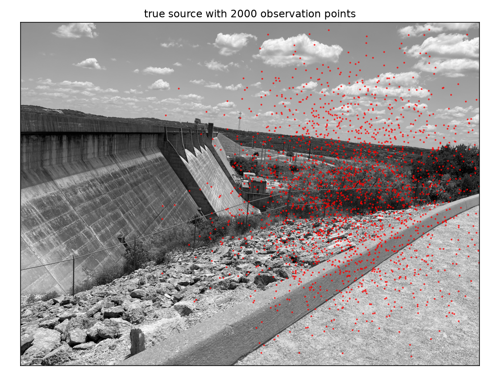
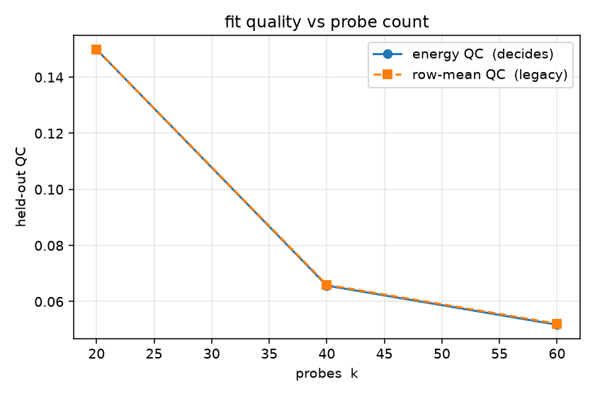
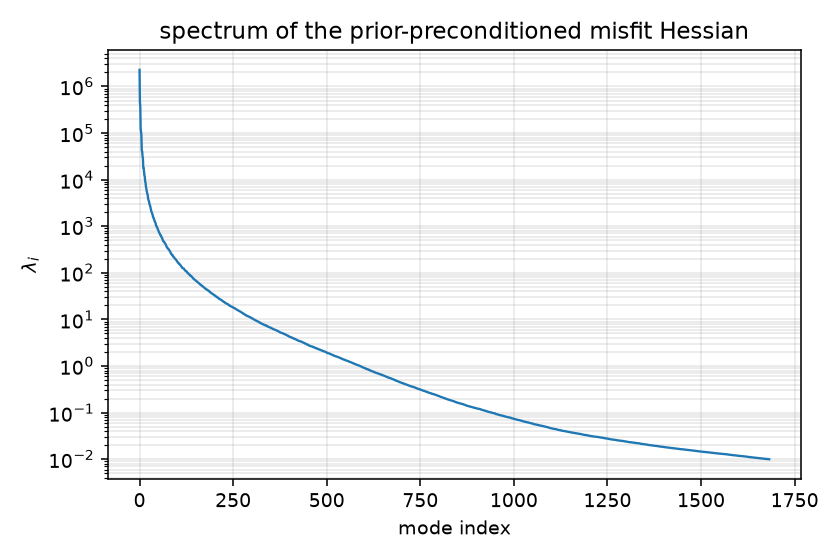
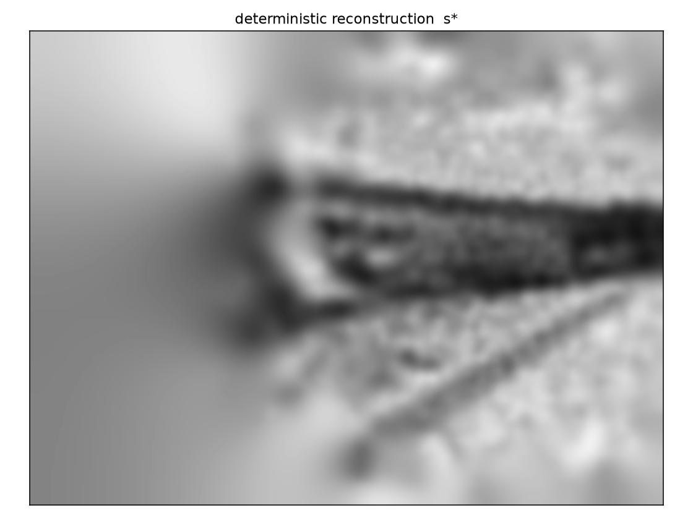
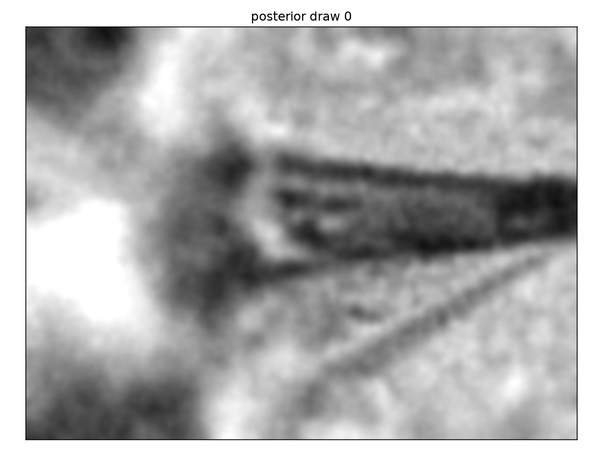
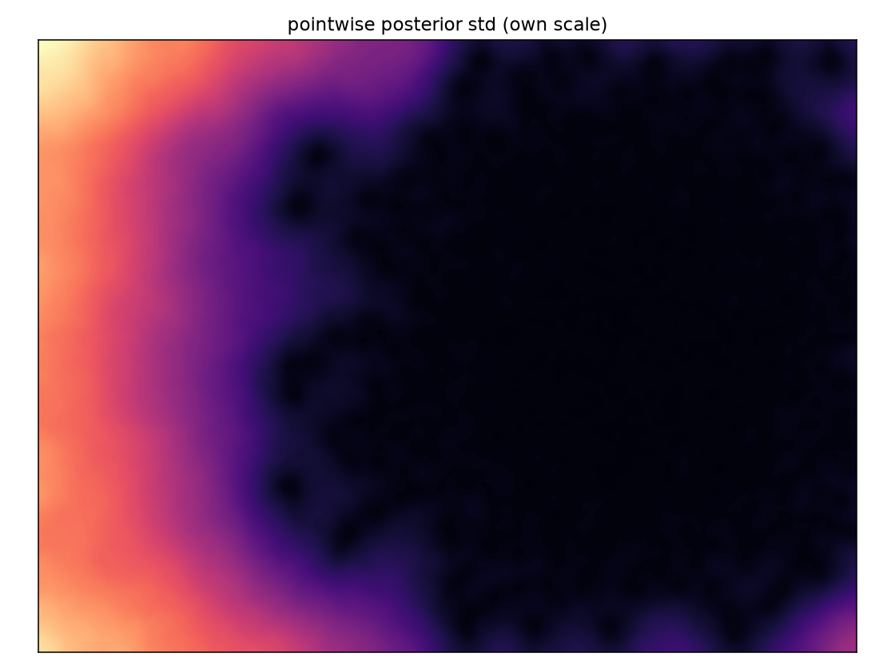

# Heat-equation source inversion with scattered observations

A complete, self-contained tour of the lgpsf-hessian pipeline on a linear
Bayesian inverse problem small enough for a laptop and rich enough to show
every stage doing real work: probing an expensive Hessian, fitting it with
Laguerre–Gaussian PSFs, converting to global low rank in the
prior-preconditioned frame, and then solving and *sampling* with the result.

Build with `-DLGH_BUILD_EXAMPLES=ON` (needs the fit component, i.e. lgpsf),
then:

```sh
cd examples/heat
./heat_source_inversion            # ~15–30 min at the default 128-px mesh
python3 plot.py                    # renders out/fig_*.png (matplotlib + Pillow)
```

`mpiexec -n 4 ./heat_source_inversion` runs the same thing distributed.

## The problem

A source field `s` on a rectangular domain diffuses for a short time `T`
under the heat equation; we observe the diffused field at `n_obs = 2000`
scattered points and add i.i.d. Gaussian noise:

$$u(T) = F s, \qquad y = B\,F s + \eta, \qquad \eta \sim N(0, \sigma^2 I).$$

`F` is the heat propagator (implicit Euler with the 5-point stiffness `K`
and lumped mass `M = h^2 I`), and `B` samples the solution at the
observation points. The observation locations are drawn from a Gaussian
centered in the right half of the domain — dense on the right, sparse on
the left — which is the experiment: *the posterior should know much more
where the data lives.*



The true source is a photograph (smooth regions, sharp edges, fine
texture), downsampled onto the grid.

With a bilaplacian-type prior precision
$R = Z M^{-1} Z$, $Z = a K + b M$ (correlation length
$\sqrt{a/b}$ = `-prior_len`, overall strength calibrated so the pointwise
prior std hits `-prior_std`), the deterministic problem and its Hessian are

$$\min_s \tfrac{1}{2\sigma^2}\lVert y - BFs\rVert^2 + \tfrac12 s^T R s,
\qquad
H = H_d + R, \quad H_d = \tfrac{1}{\sigma^2} F^T B^T B F,$$

and the Laplace posterior is $N(s^*, H^{-1})$.

`H_d` is exactly an operator with local point-spread structure: its row at
node `i` is the heat blur of the observation cloud near `i` — strong and
structured where observations are dense, near-zero on the sparse side.
That is the structure the lgpsf fit exploits.

## Stage 1 — probe and fit

Each Hessian application costs two heat solves (forward and adjoint), so we
spend them on random probes and fit every row once:

```c
lgh_fit_t *fit = lgh_fit_create(comm, 2, nloc, gid0, coords, mass, threads);
lgh_sigma_isotropic(2, nloc, ell_field, sigma);   /* ell = 2 sqrt(2 kappa T) */
lgh_fit_probes(fit, k, V, HV, sigma, &opts, &report);
Mat B_lg;  lgh_fit_get_mat(fit, &B_lg);           /* symmetric MPIAIJ */
```

The a-priori ellipsoids come straight from the physics: the impulse
response `F δ` is a Gaussian of width $\sigma_\text{heat} = \sqrt{2\kappa T}$,
so `ell = 2 σ_heat` — the ×5 support margin is lgpsf's window
(`tau_window`), not the ellipsoid.

The one number that matters is the held-out **energy QC**,
$\sqrt{\sum\lVert B_{lg} z - H_d z\rVert^2 / \sum\lVert H_d z\rVert^2}$
over whitened probes — an estimate of the relative Frobenius error. The
example fits at increasing `k` from one precomputed probe set:



A lesson this example teaches the hard way (reproduce it with
`-kmax 20`): at `qcE ≈ 0.23` the *replace-the-Hessian* strategy below
produces garbage — the fit-error tail of `B_lg` carries spurious curvature
that the solve happily inverts. At `qcE ≈ 0.07` everything snaps into
place. If you use the approximation as the operator (rather than as a
preconditioner), drive the QC down first.

## Stage 2 — prior and global low rank

```c
lgh_prior_t *prior;  lgh_prior_create_mat(Z, mass_vec, &popts, &prior);
lgh_glr_t *glr;      lgh_glr_compute(B_lg, prior, &gopts, &glr, &grep);
```

The engine sweeps only the *fitted sparse* operator — no more heat solves —
and eigendecomposes $F_w = M^{1/2}Z^{-1} B_{lg} Z^{-1} M^{1/2}$ with a
hashed, partition-independent sketch (`ell = 2200` over 2000 observations;
`report.next_abs` under the truncation cut is the evidence the rank
converged — `lgh_glr_extend` grows the sketch if it is not).



The spectrum falls from ~10⁶ through the `λ ≈ 1` crossover where data and
prior curvature balance: a few hundred well-informed directions, then the
prior takes over.

## Stage 3 — reconstruct and sample

One call each:

```c
lgh_glr_solve (glr, 1.0, rhs, s_star);   /* rhs = F^T B^T y / sigma^2  */
lgh_glr_sample(glr, 1.0, xi, d);         /* draw: s_star + d ~ N(s*, H^{-1}) */
```



The reconstruction recovers the source where the data lives and relaxes to
the prior mean where it does not; the printed Morozov ratio
(rms misfit / σ) lands within a small factor of 1 — tune `-prior_std` /
`-noise_rel` and watch it move.

Posterior draws and the empirical pointwise std from 100 draws make the
information geometry visible — low variance inside the observation cloud,
high variance on the sparsely observed left:




`lgh_glr_logdet` is printed for flavor: with location-dependent proposals,
detailed balance needs exactly this truncation-consistent quantity, read
from the same treated spectrum the sampler uses.

## Knobs

| flag | default | meaning |
|---|---|---|
| `-height` | 128 | mesh rows (341×256 at 256: ~4× the runtime) |
| `-nobs` | 2000 | observation count |
| `-noise_rel` | 0.05 | noise σ relative to signal std |
| `-prior_len` | 0.25 | prior correlation length (domain height 1) |
| `-prior_std` | 0.5 | target pointwise prior std (`-prior_b` overrides β) |
| `-kmax` | 60 | probe pairs (the QC curve fits at 20, 40, …, kmax) |
| `-ell` | 2200 | GLR sketch width |
| `-trunc_abs` | 1e-2 | spectral truncation cut |
| `-nstd` | 100 | draws for the std map |

The mesh source images are committed (`source_128.pgm`, `source_256.pgm`);
regenerate at other resolutions with `prepare_image.py` (Pillow).
